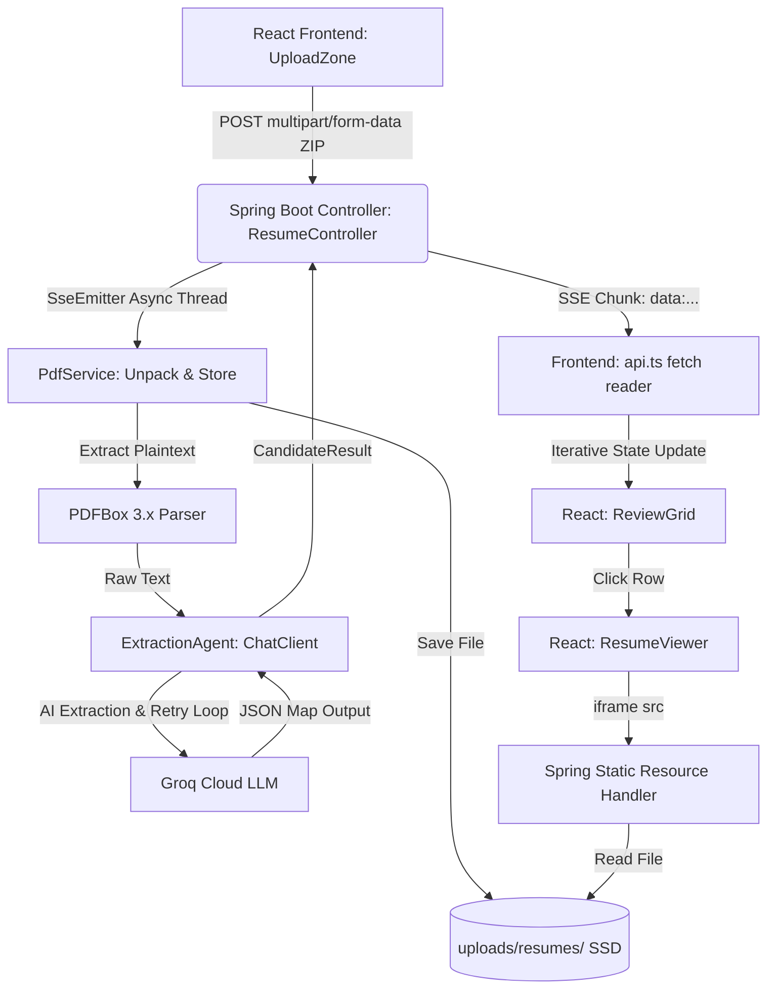

# Sprint 1 System Review: SkillSort Foundation

This document details the completed architectural foundation of **SkillSort** for Sprint 1. We have successfully implemented a resilient, end-to-end PDF processing pipeline with real-time streaming and local document hosting.

---

## 1. System Architecture



---

## 2. Component Breakdown

### Backend (Spring Boot 3.x + Spring AI)
1. **`ResumeController.java`**
   - Exposes `/api/resumes/extract` using `SseEmitter` to stream results.
   - Handled asynchronously via a cached thread executor to prevent blocking standard servlet threads.
2. **`PdfService.java`**
   - Unpacks `.zip` files in a streamed manner using `ZipInputStream` and `readAllBytes()` to support arbitrary file sizes without memory overflows.
   - Saves individual PDFs to the host filesystem under `uploads/resumes/` using UUID filenames.
   - Leverages **PDFBox 3.x** `Loader.loadPDF(File)` to extract plain text coordinates.
3. **`CorsConfig.java`**
   - Registers a `ResourceHandler` that maps `/resumes/**` requests to the physical `uploads/resumes/` folder, enabling static file serving for document viewing.
4. **`ExtractionAgent.java`**
   - Manages the interaction with Groq LLM (OpenAI-compatible Spring AI provider).
   - Implements a self-healing retry validation loop (detailed in `agents.md`).

### Frontend (React + TypeScript + Tailwind CSS)
1. **`api.ts`**
   - Submits multipart form-data.
   - Instead of waiting for a single JSON response, it opens a `ReadableStream` reader (`response.body.getReader()`) and decodes SSE chunks separated by `\n\n`.
2. **`App.tsx`**
   - Sets `isProcessing` and `hasUploaded` flags instantly.
   - Iteratively appends newly parsed `StudentData` records into the React state callback function.
3. **`ResumeViewer.tsx`**
   - Displays the original, uploaded resume in a full-height `<iframe />` pointing directly to the static endpoint (`http://localhost:8080/resumes/[UUID].pdf`).

---

## 3. Data Schema Mapping
Java records are used as lightweight, immutable data transfer objects (DTOs):

* **`ExtractedField.java`**
  ```java
  public record ExtractedField(String value, String confidence) {}
  ```
* **`CandidateResult.java`**
  ```java
  public record CandidateResult(
      String id,
      String fileName,
      Map<String, ExtractedField> extractedData
  ) {}
  ```
* **`PdfExtractionResult.java`**
  ```java
  public record PdfExtractionResult(
      String id,
      String originalFileName,
      String savedFileName,
      String rawText
  ) {}
  ```

---

## 4. Performance & Scale Profile
- **Memory Consumption:** O(1) memory complexity during ZIP unzipping due to streamed parsing.
- **Disk I/O:** Transient disk usage for uncompressed `.pdf` files.
- **Network Profile:** Multi-packet streaming connection (`text/event-stream`), lowering time-to-first-render from 30s to ~2s.
