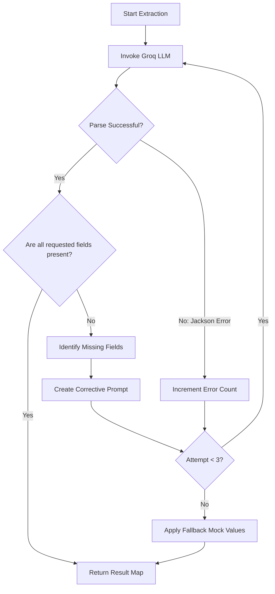

# AI Agent Behavioral & Validation Instructions

This document summarizes the core behavioral guidelines, formatting strategies, and prompt constraints implemented for the **ExtractionAgent** in Sprint 1.

---

## 1. Dynamic Structured Schema (Map Representation)
Because Java does not support dynamic Pydantic class generation at runtime (unlike Python), we enforce a robust map-based schema:
* **Target Output:** `Map<String, ExtractedField>`
* **Structure:**
  ```json
  {
    "name": { "value": "John Doe", "confidence": "high" },
    "skills": { "value": "React, Spring Boot", "confidence": "medium" }
  }
  ```
* **Spring AI Integration:** Implemented using `ParameterizedTypeReference<Map<String, ExtractedField>>` inside the `BeanOutputConverter`.

---

## 2. Agentic Self-Healing Loop (Retry & Validation)
If the LLM omits requested fields, returns flat strings instead of nested schemas, or hallucinates keys, the agent heals itself:



### Self-Healing Logic Implementation
```java
int inprogresscnt = 0;
List<String> missingFields = new ArrayList<>();

while (inprogresscnt < 3) {
    try {
        // Send request with system prompt & templates
        String response = chatClient.prompt()...call().content();
        
        // Validation function checks output maps
        Map<String, ExtractedField> parsed = converter.convert(response);
        missingFields = findMissing(parsed, requestedFields);
        
        if (missingFields.isEmpty()) {
            return parsed; // Valid return
        }
        
        // If fields are missing, modify prompt for loop
        inprogresscnt++;
        prompt.add("CRITICAL: You forgot to generate: " + missingFields + ". Please focus exclusively on extracting these now.");
        
    } catch (Exception parseException) {
        inprogresscnt++;
        // Recoverable exception: Let LLM try again with the error trace
    }
}
```

---

## 3. System Prompt & Constraints (`extraction-system-prompt.txt`)
The agent behaves under strict, non-negotiable operational parameters:

1. **Explicit Nested Object Formatting:**
   - Every single requested key *must* map to an object containing `"value"` (string) and `"confidence"` (string: `"low"`, `"medium"`, or `"high"`).
   - Flat string properties are strictly forbidden and trigger JSON schema violations.
2. **"Not Provided" Grounding Rule:**
   - If the raw text does not explicitly state a field's value, the agent must assign `"value": "Not Provided"` and `"confidence": "low"`. 
   - No assumptions, extrapolation, or guesswork are allowed.
3. **Template Context Binding:**
   - Context is injected directly utilizing placeholder tags `{fields}` and `{format}`.
